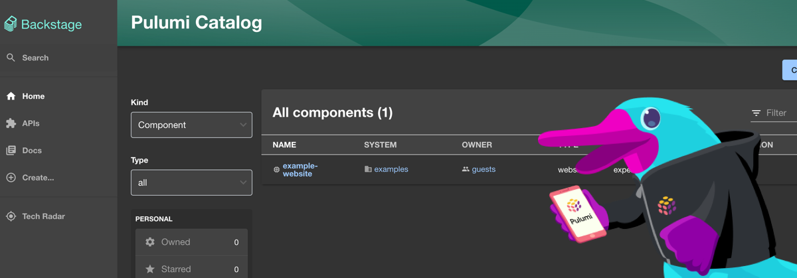

# Chapter 0 - Hello, Backstage World!



## Overview

In this chapter we will initialize the standalone app for the moment. In the later chapters we will add an external
database to it and deploy it to Azure.

To get set up quickly with your own Backstage project you can create a Backstage App.

A Backstage App is a monorepo setup with `lerna` that includes everything you need to run Backstage in your own
environment.

## Instructions

### Step 0 - Prerequisites

Create a new directory for all the workshop files and navigate into it.

```shell
mkdir pulumi-backstage-azure-workshop
cd pulumi-backstage-azure-workshop
```

This will be the root directory for the workshop. Keep this in mind for all the following steps and chapters.

### Step 1 - Create a Backstage App

Backstage provides a utility for creating new apps. It guides you through the initial setup of selecting the name of the
app and a database for the backend. The database options are either SQLite or PostgreSQL, where the latter requires you
to set up a separate database instance.

To create a new app, run the following command:

```shell
npx @backstage/create-app@latest
```

If prompted, enter a name for the app. This will be the name of the directory that is created. I suggest to
use `backstage`

```shell
? Enter a name for the app [required] backstage

Creating the app...

 Checking if the directory is available:
  checking      backstage ✔ 

 Creating a temporary app directory:

 Preparing files:
  copying       .dockerignore ✔ 
  copying       .eslintignore ✔ 
  templating    .eslintrc.js.hbs ✔ 
  templating    .gitignore.hbs ✔ 
  copying       .prettierignore ✔ 
  copying       README.md ✔ 
  copying       app-config.local.yaml ✔ 
  copying       app-config.production.yaml ✔ 
  templating    app-config.yaml.hbs ✔ 
  templating    backstage.json.hbs ✔ 
  templating    catalog-info.yaml.hbs ✔ 
  copying       lerna.json ✔ 
  templating    package.json.hbs ✔ 
  copying       playwright.config.ts ✔ 
  copying       tsconfig.json ✔ 
  copying       yarn.lock ✔ 
  copying       README.md ✔ 
  copying       entities.yaml ✔ 
  copying       org.yaml ✔ 
  copying       template.yaml ✔ 
  copying       catalog-info.yaml ✔ 
  copying       index.js ✔ 
  copying       package.json ✔ 
  copying       README.md ✔ 
  templating    .eslintrc.js.hbs ✔ 
  copying       Dockerfile ✔ 
  copying       README.md ✔ 
  templating    package.json.hbs ✔ 
  copying       index.test.ts ✔ 
  copying       index.ts ✔ 
  copying       types.ts ✔ 
  copying       app.ts ✔ 
  copying       auth.ts ✔ 
  copying       catalog.ts ✔ 
  copying       proxy.ts ✔ 
  copying       scaffolder.ts ✔ 
  templating    search.ts.hbs ✔ 
  copying       techdocs.ts ✔ 
  copying       .eslintignore ✔ 
  templating    .eslintrc.js.hbs ✔ 
  templating    package.json.hbs ✔ 
  copying       android-chrome-192x192.png ✔ 
  copying       apple-touch-icon.png ✔ 
  copying       favicon-16x16.png ✔ 
  copying       favicon-32x32.png ✔ 
  copying       favicon.ico ✔ 
  copying       index.html ✔ 
  copying       manifest.json ✔ 
  copying       robots.txt ✔ 
  copying       safari-pinned-tab.svg ✔ 
  copying       app.test.ts ✔ 
  copying       App.test.tsx ✔ 
  copying       App.tsx ✔ 
  copying       apis.ts ✔ 
  copying       index.tsx ✔ 
  copying       setupTests.ts ✔ 
  copying       LogoFull.tsx ✔ 
  copying       LogoIcon.tsx ✔ 
  copying       Root.tsx ✔ 
  copying       index.ts ✔ 
  copying       EntityPage.tsx ✔ 
  copying       SearchPage.tsx ✔ 

 Moving to final location:
  moving        backstage ✔ 

 Installing dependencies:
  determining   yarn version ✔ 
  executing     yarn install ✔ 
  executing     yarn tsc ✔ 

🥇  Successfully created backstage


 All set! Now you might want to:
  Run the app: cd backstage && yarn dev
  Set up the software catalog: https://backstage.io/docs/features/software-catalog/configuration
  Add authentication: https://backstage.io/docs/auth/
```

This can take a few minutes to complete. But you should see the current progress in the terminal.

You should now have a new directory called `backstage` in your root directory, which contains following files and
folders:

```shell
backstage/
├── README.md
├── app-config.local.yaml
├── app-config.production.yaml
├── app-config.yaml
├── backstage.json
├── catalog-info.yaml
├── dist-types
│   ├── packages
│   └── tsconfig.tsbuildinfo
├── examples
│   ├── entities.yaml
│   ├── org.yaml
│   └── template
├── lerna.json
├── package.json
├── packages
│   ├── README.md
│   ├── app
│   └── backend
├── playwright.config.ts
├── plugins
│   └── README.md
├── tsconfig.json
└── yarn.lock
```

* app-config.yaml: Main configuration file for the app.
* catalog-info.yaml: Catalog Entities descriptors.
* lerna.json: Contains information about workspaces and other lerna configuration needed for the monorepo setup.
* package.json: Root package.json for the project. Note: Be sure that you don't add any npm dependencies here as they
  probably should be installed in the intended workspace rather than in the root.
* packages/: Lerna leaf packages or "workspaces". Everything here is going to be a separate package, managed by lerna.
* packages/app/: An fully functioning Backstage frontend app, that acts as a good starting point for you to get to know
  Backstage.
* packages/backend/: The backend for Backstage.

### Step 2 - Run the App

As soon as the app is created, you can run it by navigating into the `backstage` directory and running the following
command:

```shell
cd backstage
yarn dev
```

The yarn dev command will run both the frontend and backend as separate processes (named [0] and [1]) in the same
window. When the command finishes running, it should open up a browser window displaying your app. If not, you can open
a browser and directly navigate to the frontend at `http://localhost:3000`.

### Step 3 - Explore the App

Let's have a look on some of the values in the different files and change them to your needs.

First we change the name of our organization in the `app-config.yaml` file. Open the file and change the organization
name to a name of your choice.

```yaml
organization:
  name: Pulumi
```

Because we are still in the development mode, any changes to the `app-config.yaml` file will be reflected in the app as
soon as you save the file. You can see the changes in the browser window.

### Step 4 - Add Azure DevOps Integration

The backbone of Backstage is the rich integration with different tools and services. This will be all done via the
plugin system.

> **Note**: Currently there is some major refactoring going on in the Backstage project. The plugin system will be
> changend in the near future to support a more declarative approach. This will make it easier to develop and add new
> plugins to Backstage. See the [RFC](https://github.com/backstage/backstage/issues/18372) for more information.

Add this to the `app-config.yaml` file:

```yaml
azureDevOps:
  host: dev.azure.com
  token: ${AZURE_PAT}
  organization: ${AZURE_ORG}

integrations:
  azure:
  - host: dev.azure.com
    credentials:
    - personalAccessToken: ${AZURE_PAT}
      organizations:
      - ${AZURE_ORG}
```

This will add the Azure DevOps integration to your app. The `AZURE_PAT` and `AZURE_ORG` are environment variables 
that you need to set. You can do this by adding them to the `.env` file in the root directory of the app.

```shell
AZURE_PAT=<your-azure-pat>
AZURE_ORG=<your-azure-org>
```

#### Step 4.1 - Add the Azure DevOps Backend Plugin

Add the Azure DevOps backend plugin to your backend:

```shell
# From your Backstage root directory
yarn add --cwd packages/backend @backstage/plugin-azure-devops-backend
```

Then we will create a new file named `packages/backend/src/plugins/azure-devops.ts`, and add the following to it:

```typescript
import {createRouter} from '@backstage/plugin-azure-devops-backend';
import {Router} from 'express';
import type {PluginEnvironment} from '../types';

export default function createPlugin(
    env: PluginEnvironment,
): Promise<Router> {
    return createRouter({
        logger: env.logger,
        config: env.config,
        reader: env.reader,
    });
}
```

Next we wire this into the overall backend router, edit `packages/backend/src/index.ts`:

```typescript
import azureDevOps from './plugins/azure-devops';

// ...
async function main() {
    // ...
    // Add this line under the other lines that follow the useHotMemoize pattern
    const azureDevOpsEnv = useHotMemoize(module, () => createEnv('azure-devops'));
    // ...
    // Insert this line under the other lines that add their routers to apiRouter in the same way
    apiRouter.use('/azure-devops', await azureDevOps(azureDevOpsEnv));
```

#### Step 4.2 - Add the Azure DevOps Frontend Plugin

Now we add the Azure DevOps frontend plugin to your frontend. The Azure DevOps frontend plugin contains a number of
components that can be used to display Azure DevOps data in the Backstage frontend.


```shell
# From your Backstage root directory
yarn add --cwd packages/app @backstage/plugin-azure-devops
```

##### Step 4.2.1 - Add the Azure Repos Component

Then we will create a new file named `packages/app/src/components/catalog/EntityPage.ts`, and add the following to it:

```ts
import {
  EntityAzurePullRequestsContent,
  isAzureDevOpsAvailable,
} from '@backstage/plugin-azure-devops';

// For example in the Service section
const serviceEntityPage = (
        <EntityLayout>
                // ...
                <EntityLayout.Route if={isAzureDevOpsAvailable} path="/pull-requests" title="Pull Requests">
                    <EntityAzurePullRequestsContent defaultLimit={25} />
               </EntityLayout.Route>
        </EntityLayout>
        ...
);
```

##### Step 4.2.2 - Add the Azure Pipelines Component

Then we will create a new file named `packages/app/src/components/catalog/EntityPage.ts`, and add the following to it:

```ts
// In packages/app/src/components/catalog/EntityPage.tsx
import {
  EntityAzurePipelinesContent,
  isAzureDevOpsAvailable,
} from '@backstage/plugin-azure-devops';

// For example in the CI/CD section
const cicdContent = (
  <EntitySwitch>
    // ...
    <EntitySwitch.Case if={isAzureDevOpsAvailable}>
        <EntityAzurePipelinesContent defaultLimit={25} />
    </EntitySwitch.Case>
    // ...
  </EntitySwitch>
        ...
);
```

##### Step 4.2.3 - Add the Git README

Then we will create a new file named `packages/app/src/components/catalog/EntityPage.ts`, and add the following to it:

```ts
mport {
  EntityAzureReadmeCard,
  isAzureDevOpsAvailable,
} from '@backstage/plugin-azure-devops';

// As it is a card, you can customize it the way you prefer
// For example in the Service section

const overviewContent = (
  <Grid container spacing={3} alignItems="stretch">
    <EntitySwitch>
      <EntitySwitch.Case if={isAzureDevOpsAvailable}>
        <Grid item md={6}>
          ...
        </Grid>
        <Grid item md={6}>
          <EntityAzureReadmeCard maxHeight={350} />
        </Grid>
      </EntitySwitch.Case>
    </EntitySwitch>
  </Grid>
);
```

### Step 5 - Stop the App

To stop the app, press `Ctrl+C` in the terminal where the app is running.

## Stretch Goals

- Have a look on the other Azure DevOps components and add them to your app. Have a look at the [Azure DevOps
  Plugin](https://github.com/backstage/backstage/tree/master/plugins/azure-devops) documentation for more information.

## Learn more

- [Backstage Docs](https://backstage.io/docs/overview/what-is-backstage)
- [Azure DevOps](https://azure.microsoft.com/en-us/services/devops/)
- [Pulumi](https://www.pulumi.com/docs/)
