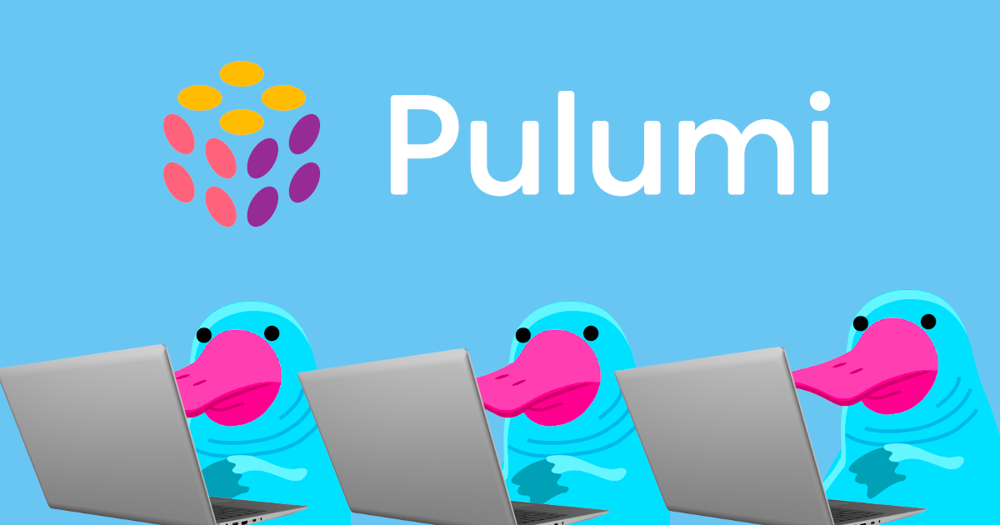

# Chapter 3 - Define the Backstage Infrastructure



## Overview

In this chapter we will define the rest of the infrastructure for our Backstage instance. In the previous chapter we set
up the Azure Container Registry and uploaded the container image of our Backstage instance. Now we will define the Azure
App Service and the Azure Database for PostgreSQL.

## Instructions

### Step 0 - Prerequisites

Head over to your directory `backstage-azure-infrastructure` and open the main file in the programming language of your
choice. In my case, I use TypeScript, so I will open the `index.ts` file.

### Step 1 - Define the Azure Operational Insights Workspace and Component

We will start by defining the Azure Operational Insights Workspace and the Component for our Backstage instance.

```typescript
const backstageOperationalInsightsWorkspace = new azure_native.operationalinsights.Workspace("backstageOperationalInsightsWorkspace", {
    resourceGroupName: resourceGroup.name,
    retentionInDays: 30,
    sku: {
        name: "PerGB2018",
    },
});
const backstageAppInsights = new azure_native.insights.Component("backstageAppInsights", {
    resourceGroupName: resourceGroup.name,
    applicationType: "other",
    kind: "other",
    workspaceResourceId: backstageOperationalInsightsWorkspace.id,
});
```

<details>
  <summary>YAML</summary>

  
      backstageOperationalInsightsWorkspace:
      type: azure-native:operationalinsights:Workspace
      properties:
        resourceGroupName: ${resourceGroup.name}
        retentionInDays: 30
        sku:
          name: PerGB2018

      backstageAppInsights:
        type: azure-native:insights:Component
        properties:
          resourceGroupName: ${resourceGroup.name}
          applicationType: other
          kind: other
          workspaceResourceId: ${backstageOperationalInsightsWorkspace.id}
  

</details>

<details>
  <summary>Go</summary>

  
    package main

    import (
        "fmt"
        "github.com/pulumi/pulumi-azure-native-sdk/authorization/v2"
        "github.com/pulumi/pulumi-azure-native-sdk/containerregistry/v2"
        "github.com/pulumi/pulumi-azure-native-sdk/dbforpostgresql/v2"
        "github.com/pulumi/pulumi-azure-native-sdk/insights/v2"
        "github.com/pulumi/pulumi-azure-native-sdk/operationalinsights/v2"
        "github.com/pulumi/pulumi-azure-native-sdk/resources/v2"
        "github.com/pulumi/pulumi-azure-native-sdk/web/v2"
        "github.com/pulumi/pulumi-azuread/sdk/v5/go/azuread"
        "github.com/pulumi/pulumi-docker/sdk/v4/go/docker"
        "github.com/pulumi/pulumi/sdk/v3/go/pulumi"
        "github.com/pulumi/pulumi/sdk/v3/go/pulumi/config"
    )
    
    func main() {
        pulumi.Run(func(ctx *pulumi.Context) error {
            // other resources
            backstageOperationalInsightsWorkspace, err := operationalinsights.NewWorkspace(ctx, "backstageOperationalInsightsWorkspace", &operationalinsights.WorkspaceArgs{
                ResourceGroupName: resourceGroup.Name,
                RetentionInDays:   pulumi.Int(30),
                Sku: &operationalinsights.WorkspaceSkuArgs{
                    Name: pulumi.String("PerGB2018"),
                },
            })
            if err != nil {
                return err
            }
            backstageAppInsights, err := insights.NewComponent(ctx, "backstageAppInsights", &insights.ComponentArgs{
                ResourceGroupName:   resourceGroup.Name,
                ApplicationType:     pulumi.String("other"),
                Kind:                pulumi.String("other"),
                WorkspaceResourceId: backstageOperationalInsightsWorkspace.ID(),
            })
            if err != nil {
                return err
            }
            return nil
        })
    }
  

</details>

<details>
  <summary>Python</summary>

  
    # other resources
    backstage_operational_insights_workspace = azure_native.operationalinsights.Workspace("backstageOperationalInsightsWorkspace",
                                                                                          resource_group_name=resource_group.name,
                                                                                          retention_in_days=30,
                                                                                          sku=azure_native.operationalinsights.WorkspaceSkuArgs(
                                                                                              name="PerGB2018",
                                                                                          ))
    backstage_app_insights = azure_native.insights.Component("backstageAppInsights",
                                                             resource_group_name=resource_group.name,
                                                             application_type="other",
                                                             kind="other",
                                                             workspace_resource_id=backstage_operational_insights_workspace.id)
  

</details>

### Step 2 - Define the Azure PostgreSQL Database

Next, we will define the [Azure Database for PostgreSQL](https://learn.microsoft.com/en-us/azure/postgresql/). As version
we will use PostgreSQL 16. According to the Backstage documentation, we can always use the last five major versions.

> Our policy mirrors the PostgreSQL versioning policy - we will support the last 5 major versions. 
> We will also test the newest and oldest versions in that range. 
> For example, if the range we support is currently 12 to 16, then we would only test 12 and 16 explicitly.
> [Backstage Documentation](https://backstage.io/docs/overview/versioning-policy/#postgresql-releases)

```typescript
const backstagePostgresqlServer = new azure_native.dbforpostgresql.v20230301preview.Server("backstagePostgresqlServer", {
    resourceGroupName: resourceGroup.name,
    sku: {
        name: "Standard_D2ds_v4",
        tier: "GeneralPurpose",
    },
    storage: {
        storageSizeGB: 32,
    },
    backup: {
        geoRedundantBackup: "Disabled",
    },
    version: "16",
    administratorLogin: "backstage",
    administratorLoginPassword: "1Backstage1!",
    serverName: `backstage-postgresql-${pulumi.getProject()}`,
});
const backstagePostgresqlFirewallRule = new azure_native.dbforpostgresql.FirewallRule("backstagePostgresqlFirewallRule", {
    resourceGroupName: resourceGroup.name,
    serverName: backstagePostgresqlServer.name,
    startIpAddress: "0.0.0.0",
    endIpAddress: "255.255.255.255",
});
const backstagePostgresqlDatabase = new azure_native.dbforpostgresql.Database("backstagePostgresqlDatabase", {
    resourceGroupName: resourceGroup.name,
    serverName: backstagePostgresqlServer.name,
    collation: "en_US.utf8",
    charset: "UTF8",
});
```

<details>
  <summary>YAML</summary>

  
      backstagePostgresqlServer:
        type: azure-native:dbforpostgresql/v20230301preview:Server
        properties:
          resourceGroupName: ${resourceGroup.name}
          sku:
            name: "Standard_D2ds_v4"
            tier: "GeneralPurpose"
          storage:
            storageSizeGB: 32
          backup:
            geoRedundantBackup: "Disabled"
          version: "16"
          administratorLogin: "backstage"
          administratorLoginPassword: "1Backstage1!"
          serverName: "backstage-postgresql-${pulumi.project}"
    
      backstagePostgresqlFirewallRule:
        type: azure-native:dbforpostgresql:FirewallRule
        properties:
          resourceGroupName: ${resourceGroup.name}
          serverName: ${backstagePostgresqlServer.name}
          startIpAddress: "0.0.0.0"
          endIpAddress: "255.255.255.255"
    
      backstagePostgresqlDatabase:
        type: azure-native:dbforpostgresql:Database
        properties:
          resourceGroupName: ${resourceGroup.name}
          serverName: ${backstagePostgresqlServer.name}
          collation: "en_US.utf8"
          charset: "UTF8"
  

</details>

<details>
  <summary>Go</summary>

  
    package main

    import (
        "fmt"
        "github.com/pulumi/pulumi-azure-native-sdk/authorization/v2"
        "github.com/pulumi/pulumi-azure-native-sdk/containerregistry/v2"
        "github.com/pulumi/pulumi-azure-native-sdk/dbforpostgresql/v2"
        "github.com/pulumi/pulumi-azure-native-sdk/insights/v2"
        "github.com/pulumi/pulumi-azure-native-sdk/operationalinsights/v2"
        "github.com/pulumi/pulumi-azure-native-sdk/resources/v2"
        "github.com/pulumi/pulumi-azure-native-sdk/web/v2"
        "github.com/pulumi/pulumi-azuread/sdk/v5/go/azuread"
        "github.com/pulumi/pulumi-docker/sdk/v4/go/docker"
        "github.com/pulumi/pulumi/sdk/v3/go/pulumi"
        "github.com/pulumi/pulumi/sdk/v3/go/pulumi/config"
    )
    
    func main() {
        pulumi.Run(func(ctx *pulumi.Context) error {
            
            backstagePostgresqlServer, err := dbforpostgresql.NewServer(ctx, "backstagePostgresqlServer", &dbforpostgresql.ServerArgs{
                ResourceGroupName: resourceGroup.Name,
                Sku: &dbforpostgresql.SkuArgs{
                    Name: pulumi.String("Standard_D2ds_v4"),
                    Tier: pulumi.String("GeneralPurpose"),
                },
                Storage: &dbforpostgresql.StorageArgs{
                    StorageSizeGB: pulumi.Int(32),
                },
                Backup: &dbforpostgresql.BackupArgs{
                    GeoRedundantBackup: pulumi.String("Disabled"),
                },
                Version:                    pulumi.String("16"),
                AdministratorLogin:         pulumi.String("backstage"),
                AdministratorLoginPassword: pulumi.String("1Backstage1!"),
                ServerName:                 pulumi.String(fmt.Sprintf("backstage-postgresql-%v", ctx.Project())),
            })
            if err != nil {
                return err
            }
            _, err = dbforpostgresql.NewFirewallRule(ctx, "backstagePostgresqlFirewallRule", &dbforpostgresql.FirewallRuleArgs{
                ResourceGroupName: resourceGroup.Name,
                ServerName:        backstagePostgresqlServer.Name,
                StartIpAddress:    pulumi.String("0.0.0.0"),
                EndIpAddress:      pulumi.String("255.255.255.255"),
            })
            if err != nil {
                return err
            }
            _, err = dbforpostgresql.NewDatabase(ctx, "backstagePostgresqlDatabase", &dbforpostgresql.DatabaseArgs{
                ResourceGroupName: resourceGroup.Name,
                ServerName:        backstagePostgresqlServer.Name,
                Collation:         pulumi.String("en_US.utf8"),
                Charset:           pulumi.String("UTF8"),
            })
            if err != nil {
                return err
            }
            ctx.Export("repoDigest", backstageImage.RepoDigest)
            return nil
        })
    }
  

</details>

<details>
  <summary>Python</summary>

  
    backstage_postgresql_server = azure_native.dbforpostgresql.v20230301preview.Server("backstagePostgresqlServer",
                                                                                       resource_group_name=resource_group.name,
                                                                                       sku=azure_native.dbforpostgresql.v20230301preview.SkuArgs(
                                                                                           name="Standard_D2ds_v4",
                                                                                           tier="GeneralPurpose",
                                                                                       ),
                                                                                       storage=azure_native.dbforpostgresql.v20230301preview.StorageArgs(
                                                                                           storage_size_gb=32,
                                                                                       ),
                                                                                       backup=azure_native.dbforpostgresql.v20230301preview.BackupArgs(
                                                                                           geo_redundant_backup="Disabled",
                                                                                       ),
                                                                                       version="16",
                                                                                       administrator_login="backstage",
                                                                                       administrator_login_password="1Backstage1!",
                                                                                       server_name=f"backstage-postgresql-{pulumi.get_project()}")
    backstage_postgresql_firewall_rule = azure_native.dbforpostgresql.FirewallRule("backstagePostgresqlFirewallRule",
                                                                                   resource_group_name=resource_group.name,
                                                                                   server_name=backstage_postgresql_server.name,
                                                                                   start_ip_address="0.0.0.0",
                                                                                   end_ip_address="255.255.255.255")
    backstage_postgresql_database = azure_native.dbforpostgresql.Database("backstagePostgresqlDatabase",
                                                                          resource_group_name=resource_group.name,
                                                                          server_name=backstage_postgresql_server.name,
                                                                          collation="en_US.utf8",
                                                                          charset="UTF8")
  

</details>

### Step 3 - Define the Azure App Service

Finally, we will define the [Azure App Service](https://learn.microsoft.com/en-us/azure/app-service/overview). As usual
there are several ways on how to host a web application in Azure. We will use the Azure App Service for this example, you 
can also use [Azure Kubernetes Service](https://learn.microsoft.com/en-us/azure/aks/intro-kubernetes) or [Azure Container Instances](https://learn.microsoft.com/en-us/azure/container-instances/container-instances-overview).

The Azure App Service is a fully managed platform for building, deploying, and scaling web apps. We will use the 
Linux based App Service Plan and the Linux based Web App.

We pass the connection details for the PostgreSQL database, the Azure DevOps token and organization, the Application 
Insights Key and other settings to the Web App as environment variables. In a real-world scenario, you would use Azure 
Key Vault to store these secrets and use the Managed Identity of the Web App to access the secrets. Again, we simplify 
the workshop here. 

```typescript
//imports

const config = new pulumi.Config();
const azureDevOpsToken = config.require("azureDevOpsToken");
const azureDevOpsOrganization = config.get("azureDevOpsOrganization") || "dirien";
// other resources

const backstageAppServicePlan = new azure_native.web.AppServicePlan("backstageAppServicePlan", {
    resourceGroupName: resourceGroup.name,
    kind: "Linux",
    sku: {
        name: "S1",
        tier: "Standard",
    },
    reserved: true,
    isSpot: false,
});
const backstageWebApp = new azure_native.web.WebApp("backstageWebApp", {
    name: "my-backstage-app",
    resourceGroupName: resourceGroup.name,
    serverFarmId: backstageAppServicePlan.id,
    kind: "app,linux,container",
    identity: {
        type: azure_native.web.ManagedServiceIdentityType.SystemAssigned,
    },
    siteConfig: {
        cors: {
            supportCredentials: true,
            allowedOrigins: ["https://my-backstage-app.azurewebsites.net"],
        },
        httpLoggingEnabled: true,
        appSettings: [
            {
                name: "POSTGRES_HOST",
                value: backstagePostgresqlServer.fullyQualifiedDomainName,
            },
            {
                name: "POSTGRES_PORT",
                value: "5432",
            },
            {
                name: "POSTGRES_USER",
                value: backstagePostgresqlServer.administratorLogin.apply(administratorLogin => administratorLogin || "xxx"),
            },
            {
                name: "POSTGRES_PASSWORD",
                value: "1Backstage1!",
            },
            {
                name: "AZURE_PAT",
                value: azureDevOpsToken,
            },
            {
                name: "AZURE_ORG",
                value: azureDevOpsOrganization,
            },
            {
                name: "APPINSIGHTS_INSTRUMENTATIONKEY",
                value: backstageAppInsights.instrumentationKey,
            },
            {
                name: "DOCKER_ENABLE_CI",
                value: "true",
            },
            {
                name: "WEBSITES_PORT",
                value: "7007",
            },
            {
                name: "PORT",
                value: "8080",
            },
            {
                name: "BACKSTAGE_BASE_URL",
                value: "https://my-backstage-app.azurewebsites.net",
            },
            {
                name: "APP_CONFIG_backend_database_connection_ssl_required",
                value: "true",
            },
            {
                name: "APP_CONFIG_backend_database_connection_ssl_rejectUnauthorized",
                value: "true",
            },
        ],
        acrUseManagedIdentityCreds: true,
        linuxFxVersion: pulumi.interpolate`DOCKER|${backstageImage.repoDigest}`,
    },
});
const roleAssignment3 = new azure_native.authorization.RoleAssignment("roleAssignment3", {
    principalId: backstageWebApp.identity.apply(identity => identity?.principalId || ""),
    roleDefinitionId: acrPullRoleDefinition.apply(acrPullRoleDefinition => acrPullRoleDefinition.id),
    scope: backstageContainerRegistry.id,
    principalType: "ServicePrincipal",
});

export const backstageWebAppUrl = pulumi.interpolate`https://${backstageWebApp.defaultHostName}`;
```

<details>
  <summary>YAML</summary>

  
    config:
      azureDevOpsToken:
        type: string
      azureDevOpsOrganization:
        type: string
        default: "dirien"
    resources:
      # other resources
        backstageAppServicePlan:
        type: azure-native:web:AppServicePlan
        properties:
          resourceGroupName: ${resourceGroup.name}
          kind: "Linux"
          sku:
            name: "S1"
            tier: "Standard"
          reserved: true
          isSpot: false
    
        backstageWebApp:
          type: azure-native:web:WebApp
          properties:
            name: "my-backstage-app"
            resourceGroupName: ${resourceGroup.name}
            serverFarmId: ${backstageAppServicePlan.id}
            kind: "app,linux,container"
            identity:
              type: SystemAssigned
            siteConfig:
              cors:
                supportCredentials: true
                allowedOrigins:
                - "https://my-backstage-app.azurewebsites.net"
              httpLoggingEnabled: true
              appSettings:
              - name: POSTGRES_HOST
                value: ${backstagePostgresqlServer.fullyQualifiedDomainName}
              - name: POSTGRES_PORT
                value: "5432"
              - name: POSTGRES_USER
                value: ${backstagePostgresqlServer.administratorLogin}
              - name: POSTGRES_PASSWORD
                value: "1Backstage1!"
              - name: AZURE_PAT
                value: ${azureDevOpsToken}
              - name: AZURE_ORG
                value: ${azureDevOpsOrganization}
              - name: APPINSIGHTS_INSTRUMENTATIONKEY
                value: ${backstageAppInsights.instrumentationKey}
              - name: DOCKER_ENABLE_CI
                value: "true"
              - name: WEBSITES_PORT
                value: "7007"
              - name: PORT
                value: "8080"
              - name: BACKSTAGE_BASE_URL
                value: "https://my-backstage-app.azurewebsites.net"
              - name: APP_CONFIG_backend_database_connection_ssl_required
                value: "true"
              - name: APP_CONFIG_backend_database_connection_ssl_rejectUnauthorized
                value: "true"
              acrUseManagedIdentityCreds: true
              linuxFxVersion: "DOCKER|${backstageImage.repoDigest}"
    
        roleAssignment3:
          type: azure-native:authorization:RoleAssignment
          properties:
            principalId: ${backstageWebApp.identity.principalId}
            roleDefinitionId: ${acrPullRoleDefinition.id}
            scope: ${backstageContainerRegistry.id}
            principalType: ServicePrincipal

    outputs:
      backstage-webapp-url: ${backstageWebApp.defaultHostName}
      repo-digest: ${backstageImage.repoDigest}
  

</details>

<details>
  <summary>Go</summary>

  
    package main

    import (
        "fmt"
        "github.com/pulumi/pulumi-azure-native-sdk/authorization/v2"
        "github.com/pulumi/pulumi-azure-native-sdk/containerregistry/v2"
        "github.com/pulumi/pulumi-azure-native-sdk/dbforpostgresql/v2"
        "github.com/pulumi/pulumi-azure-native-sdk/insights/v2"
        "github.com/pulumi/pulumi-azure-native-sdk/operationalinsights/v2"
        "github.com/pulumi/pulumi-azure-native-sdk/resources/v2"
        "github.com/pulumi/pulumi-azure-native-sdk/web/v2"
        "github.com/pulumi/pulumi-azuread/sdk/v5/go/azuread"
        "github.com/pulumi/pulumi-docker/sdk/v4/go/docker"
        "github.com/pulumi/pulumi/sdk/v3/go/pulumi"
        "github.com/pulumi/pulumi/sdk/v3/go/pulumi/config"
    )
    
    func main() {
        pulumi.Run(func(ctx *pulumi.Context) error {
            cfg := config.New(ctx, "")
            azureDevOpsToken := cfg.Require("azureDevOpsToken")
            azureDevOpsOrganization := "dirien"
            if param := cfg.Get("azureDevOpsOrganization"); param != "" {
                azureDevOpsOrganization = param
            }
            
            backstageAppServicePlan, err := web.NewAppServicePlan(ctx, "backstageAppServicePlan", &web.AppServicePlanArgs{
                ResourceGroupName: resourceGroup.Name,
                Kind:              pulumi.String("Linux"),
                Sku: &web.SkuDescriptionArgs{
                    Name: pulumi.String("S1"),
                    Tier: pulumi.String("Standard"),
                },
                Reserved: pulumi.Bool(true),
                IsSpot:   pulumi.Bool(false),
            })
            if err != nil {
                return err
            }
            backstageWebApp, err := web.NewWebApp(ctx, "backstageWebApp", &web.WebAppArgs{
                Name:              pulumi.String("my-backstage-app"),
                ResourceGroupName: resourceGroup.Name,
                ServerFarmId:      backstageAppServicePlan.ID(),
                Kind:              pulumi.String("app,linux,container"),
                Identity: &web.ManagedServiceIdentityArgs{
                    Type: web.ManagedServiceIdentityTypeSystemAssigned,
                },
                SiteConfig: &web.SiteConfigArgs{
                    Cors: &web.CorsSettingsArgs{
                        SupportCredentials: pulumi.Bool(true),
                        AllowedOrigins: pulumi.StringArray{
                            pulumi.String("https://my-backstage-app.azurewebsites.net"),
                        },
                    },
                    HttpLoggingEnabled: pulumi.Bool(true),
                    AppSettings: web.NameValuePairArray{
                        &web.NameValuePairArgs{
                            Name:  pulumi.String("POSTGRES_HOST"),
                            Value: backstagePostgresqlServer.FullyQualifiedDomainName,
                        },
                        &web.NameValuePairArgs{
                            Name:  pulumi.String("POSTGRES_PORT"),
                            Value: pulumi.String("5432"),
                        },
                        &web.NameValuePairArgs{
                            Name:  pulumi.String("POSTGRES_USER"),
                            Value: backstagePostgresqlServer.AdministratorLogin,
                        },
                        &web.NameValuePairArgs{
                            Name:  pulumi.String("POSTGRES_PASSWORD"),
                            Value: pulumi.String("1Backstage1!"),
                        },
                        &web.NameValuePairArgs{
                            Name:  pulumi.String("AZURE_PAT"),
                            Value: pulumi.String(azureDevOpsToken),
                        },
                        &web.NameValuePairArgs{
                            Name:  pulumi.String("AZURE_ORG"),
                            Value: pulumi.String(azureDevOpsOrganization),
                        },
                        &web.NameValuePairArgs{
                            Name:  pulumi.String("APPINSIGHTS_INSTRUMENTATIONKEY"),
                            Value: backstageAppInsights.InstrumentationKey,
                        },
                        &web.NameValuePairArgs{
                            Name:  pulumi.String("DOCKER_ENABLE_CI"),
                            Value: pulumi.String("true"),
                        },
                        &web.NameValuePairArgs{
                            Name:  pulumi.String("WEBSITES_PORT"),
                            Value: pulumi.String("7007"),
                        },
                        &web.NameValuePairArgs{
                            Name:  pulumi.String("PORT"),
                            Value: pulumi.String("8080"),
                        },
                        &web.NameValuePairArgs{
                            Name:  pulumi.String("BACKSTAGE_BASE_URL"),
                            Value: pulumi.String("https://my-backstage-app.azurewebsites.net"),
                        },
                        &web.NameValuePairArgs{
                            Name:  pulumi.String("APP_CONFIG_backend_database_connection_ssl_required"),
                            Value: pulumi.String("true"),
                        },
                        &web.NameValuePairArgs{
                            Name:  pulumi.String("APP_CONFIG_backend_database_connection_ssl_rejectUnauthorized"),
                            Value: pulumi.String("true"),
                        },
                    },
                    AcrUseManagedIdentityCreds: pulumi.Bool(true),
                    LinuxFxVersion: backstageImage.RepoDigest.ApplyT(func(repoDigest string) (string, error) {
                        return fmt.Sprintf("DOCKER|%v", repoDigest), nil
                    }).(pulumi.StringOutput),
                },
            })
            if err != nil {
                return err
            }
            _, err = authorization.NewRoleAssignment(ctx, "roleAssignment3", &authorization.RoleAssignmentArgs{
                PrincipalId:      backstageWebApp.Identity.PrincipalId().Elem(),
                RoleDefinitionId: acrPullRoleDefinition.Id(),
                Scope:            backstageContainerRegistry.ID(),
                PrincipalType:    pulumi.String("ServicePrincipal"),
            })
            if err != nil {
                return err
            }
            ctx.Export("backstageWebAppUrl", pulumi.Sprintf("https://%v", backstageWebApp.DefaultHostName))
            return nil
        })
    }
  

</details>

<details>
  <summary>Python</summary>

  
    config = pulumi.Config()
    azure_dev_ops_token = config.require("azureDevOpsToken")
    azure_dev_ops_organization = config.get("azureDevOpsOrganization")
    if azure_dev_ops_organization is None:
        azure_dev_ops_organization = "dirien"
    # other resources
    backstage_app_service_plan = azure_native.web.AppServicePlan("backstageAppServicePlan",
                                                                 resource_group_name=resource_group.name,
                                                                 kind="Linux",
                                                                 sku=azure_native.web.SkuDescriptionArgs(
                                                                     name="S1",
                                                                     tier="Standard",
                                                                 ),
                                                                 reserved=True,
                                                                 is_spot=False)
    backstage_web_app = azure_native.web.WebApp("backstageWebApp",
                                                name="my-backstage-app",
                                                resource_group_name=resource_group.name,
                                                server_farm_id=backstage_app_service_plan.id,
                                                kind="app,linux,container",
                                                identity=azure_native.web.ManagedServiceIdentityArgs(
                                                    type=azure_native.web.ManagedServiceIdentityType.SYSTEM_ASSIGNED,
                                                ),
                                                site_config=azure_native.web.SiteConfigArgs(
                                                    cors=azure_native.web.CorsSettingsArgs(
                                                        support_credentials=True,
                                                        allowed_origins=["https://my-backstage-app.azurewebsites.net"],
                                                    ),
                                                    http_logging_enabled=True,
                                                    app_settings=[
                                                        azure_native.web.NameValuePairArgs(
                                                            name="POSTGRES_HOST",
                                                            value=backstage_postgresql_server.fully_qualified_domain_name,
                                                        ),
                                                        azure_native.web.NameValuePairArgs(
                                                            name="POSTGRES_PORT",
                                                            value="5432",
                                                        ),
                                                        azure_native.web.NameValuePairArgs(
                                                            name="POSTGRES_USER",
                                                            value=backstage_postgresql_server.administrator_login,
                                                        ),
                                                        azure_native.web.NameValuePairArgs(
                                                            name="POSTGRES_PASSWORD",
                                                            value="1Backstage1!",
                                                        ),
                                                        azure_native.web.NameValuePairArgs(
                                                            name="AZURE_PAT",
                                                            value=azure_dev_ops_token,
                                                        ),
                                                        azure_native.web.NameValuePairArgs(
                                                            name="AZURE_ORG",
                                                            value=azure_dev_ops_organization,
                                                        ),
                                                        azure_native.web.NameValuePairArgs(
                                                            name="APPINSIGHTS_INSTRUMENTATIONKEY",
                                                            value=backstage_app_insights.instrumentation_key,
                                                        ),
                                                        azure_native.web.NameValuePairArgs(
                                                            name="DOCKER_ENABLE_CI",
                                                            value="true",
                                                        ),
                                                        azure_native.web.NameValuePairArgs(
                                                            name="WEBSITES_PORT",
                                                            value="7007",
                                                        ),
                                                        azure_native.web.NameValuePairArgs(
                                                            name="PORT",
                                                            value="8080",
                                                        ),
                                                        azure_native.web.NameValuePairArgs(
                                                            name="BACKSTAGE_BASE_URL",
                                                            value="https://my-backstage-app.azurewebsites.net",
                                                        ),
                                                        azure_native.web.NameValuePairArgs(
                                                            name="APP_CONFIG_backend_database_connection_ssl_required",
                                                            value="true",
                                                        ),
                                                        azure_native.web.NameValuePairArgs(
                                                            name="APP_CONFIG_backend_database_connection_ssl_rejectUnauthorized",
                                                            value="true",
                                                        ),
                                                    ],
                                                    acr_use_managed_identity_creds=True,
                                                    linux_fx_version=backstage_image.repo_digest.apply(lambda repo_digest: f"DOCKER|{repo_digest}"),
                                                ))
    role_assignment3 = azure_native.authorization.RoleAssignment("roleAssignment3",
                                                                 principal_id=backstage_web_app.identity.principal_id,
                                                                 role_definition_id=acr_pull_role_definition.id,
                                                                 scope=backstage_container_registry.id,
                                                                 principal_type="ServicePrincipal")
    pulumi.export("backstageWebAppUrl", pulumi.Output.concat("https://", backstage_web_app.default_host_name))
  

</details>

<br/>
We will also output the URL of the Azure App Service.

> **Note:** Please change the `name` of the `backstageWebApp` to a name of your choice. And also change the `value` of
> `BACKSTAGE_BASE_URL` to the URL of your Azure App Service. Also, the `allowedOrigins` in the `siteConfig` should be
> changed to the URL of your Azure App Service. In my case, I use `https://my-backstage-app.azurewebsites.net`.

You may notice that we are using the `azureDevOpsToken` and `azureDevOpsOrganization` variables. You can set the
`azureDevOpsOrganization` in the code and the `azureDevOpsToken` using the `pulumi config` command.

```shell
pulumi config set azureDevOpsToken --secret
```

### Step 4 - Run Pulumi Up

> Before you can run `pulumi up`, you need to be sure that your Azure credentials are set.

```shell
pulumi up
```

This command will show you a preview of all the resources and asks you if you want to deploy them. You can run dedicated
commands to see the preview or to deploy the resources.

```shell
pulumi preview
# or
pulumi up
```

You should see the following output:

```shell
...
Outputs:
  + backstageWebAppUrl: "https://my-backstage-app.azurewebsites.net"
  + repoDigest        : "pulumibackstage.azurecr.io/backstage@sha256:0f44f9e3392a1c8ef3fe5fea019111cf6bd328c7fa542d29f3108627e87f7578"
```

### Step 5 - Test the Azure App Service

You can now open the URL of the Azure App Service in your browser and see the Backstage instance running. Head also to
the Azure Portal and check the logs of the Azure App Service and the Azure Database for PostgreSQL.

## Stretch Goals

- ...

## Learn more

- [Pulumi](https://www.pulumi.com/)
- [Pulumi Azure Native Provider](https://www.pulumi.com/registry/packages/azure-native/)
- [Pulumi Microsoft Entra ID Provider](https://www.pulumi.com/registry/packages/azuread/)
- [Pulumi Docker Provider](https://www.pulumi.com/registry/packages/docker/)
