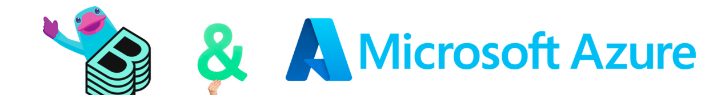

# Hands-on with Backstage on Azure: From App Service to Azure DevOps

 

 

 

## Welcome, Backstage, Pulumi and Azure Friends! 👋

The goal of this workshop is for you to learn how to use Pulumi to deploy a Backstage instance to Azure. We will start
by initializing anc configuring Backstage to work with Azure DevOps. In further chapters we will then define the
infrastructure with Pulumi and deploy it to Azure.

This should give you a good understanding of how to use Pulumi to deploy infrastructure to Azure and how to use
Backstage for your Internal Developer Portal.

Little Bonus: You will also learn how to use [Azure](https://azure.microsoft.com)

### Repository

You can find the repository for this workshop [here](https://github.com/dirien/pulumi-backstage-azure-workshop.git).
Please feel free to look for the examples in the different chapters if you get stuck.

### Content

- [Chapter 0 - Hello, Backstage World!](./00-hello-backstage-world.md)
- [Chapter 1 - Pulumi & Azure!](./01-pulumi-and-azure.md)
- [Chapter 2 - Containerize Backstage](./02-containerize-backstage.md)
- [Chapter 3 - Define the Backstage Infrastructure](./03-define-the-backstage-infrastructure.md)
- [Chapter 4 - Housekeeping!](./04-housekeeping.md)

### Prerequisites

You will need to install these tools in order to complete this workshop:

- [Pulumi](https://www.pulumi.com/docs/get-started/install/)
- [Pulumi Account](https://app.pulumi.com/signup) - this optional, but convenient to handle the state of the different
  stacks.
- [Azure CLI](https://docs.microsoft.com/en-us/cli/azure/install-azure-cli)
- [Azure Account](https://azure.microsoft.com/en-us/free)
- [Azure DevOps Account](https://azure.microsoft.com/en-us/products/devops/)
- [node.js](https://nodejs.org/en/download/)
- [Go](https://golang.org/doc/install)
- [Python](https://www.python.org/downloads/)
- [Docker](https://docs.docker.com/get-docker/)

There is also a [devcontainer.json](.devcontainer/devcontainer.json) file in this repository which you can use to spin
up a `devcontainer` with all the tools installed. Highly recommended if you are
using [VSCode](https://code.visualstudio.com/docs/devcontainers/containers), [GitHub Codespaces](https://docs.github.com/en/codespaces/overview)
or [DevPods](https://devpod.sh).

### Install DevPod and the Azure DevPod provider

The best results you will get if you use [DevPods](https://devpod.sh) to run this workshop.

Select the Provider of your choice and configure it. You can find the documentation for the different
providers [here](https://devpod.sh/docs/managing-providers/add-provider).

Now you can add a new workspace by clicking on `Workspaces` -> `+ Create` and
enter `github.com/dirien/pulumi-backstage-azure-workshop.git` in the `Enter Workspace Source and click `Create Workspace`.

### Troubleshooting Tips

If you encounter any challenges during the workshops, consider the following steps in order:

1. Don't hesitate to reach out to me! I'm always here to assist and get you back on track.
1. Review the example code available [here](https://github.com/dirien/pulumi-aws-workshop).
1. Search for the error on Google. Honestly, this method often provides the most insightful solutions.
1. Engage with the Pulumi Community on Slack. If you haven't joined yet, you can do
   so [here](https://slack.pulumi.com/).

### Want to know more?

If you enjoyed this workshop, please some of Pulumi's other [learning materials](https://www.pulumi.com/learn/)
